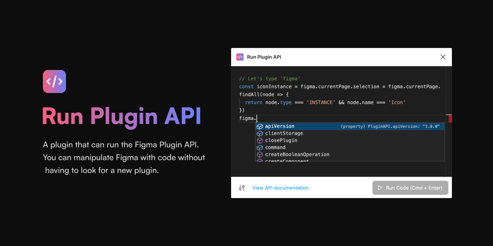

# Run Plugin API Figma Plugin

A plugin that can run the Figma Plugin API.  
You can manipulate Figma with code without having to look for a new plugin.

## 🔥 What you can:

- EVERYTHING you can do with the FIgma plugin ([API documentation](https://www.figma.com/plugin-docs/api/api-reference/))
- IntelliSense for programming (code completion, parameter info, quick info, and member lists)
- Customize editor settings
- Change theme of editor
- Use keyboard shortcuts (Cmd + Enter to run code, Cmd + S to apply settings, and Esc to close plugin)

## 📮 Support:

If you have any plobrem or feedback, please use the [GitHub Issues](https://github.com/ryonakae/figma-plugin-run-plugin-api/issues).

---

This plugin is made by Ryo Nakae 🙎‍♂️.

- https://brdr.jp
- https://twitter.com/ryo_dg
- https://github.com/ryonakae
